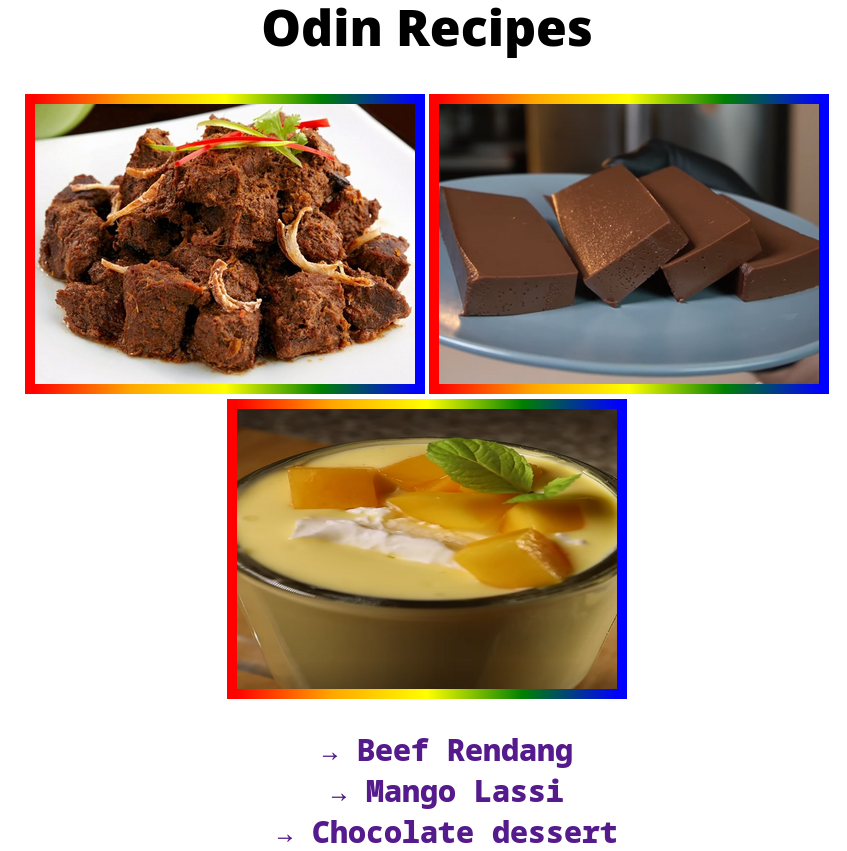

This project is a part of the odin project foundation course.
The goal of this project is to build recipe website

[Live prev](https://mx-99.github.io/odin-recipes/)

# To-do

- Basic Html structure
- Hover effects
- Go back home
- css styling
